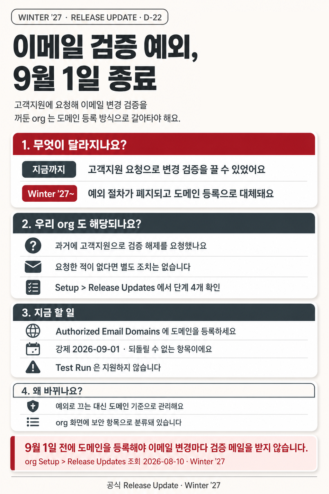
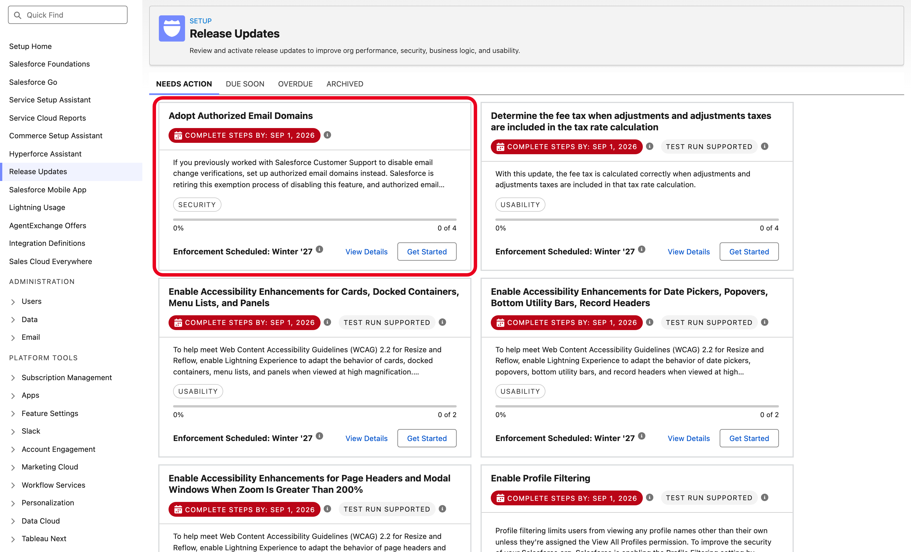
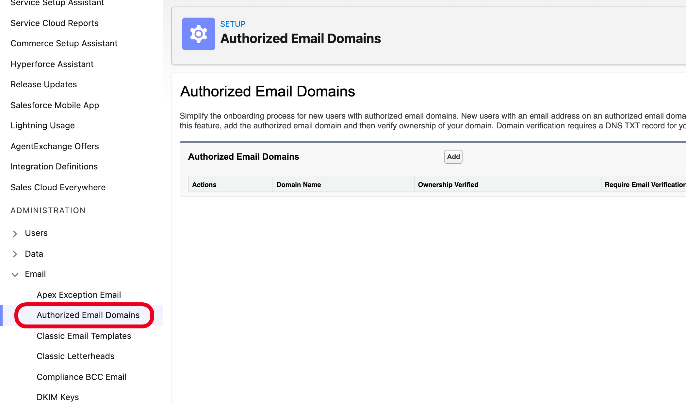
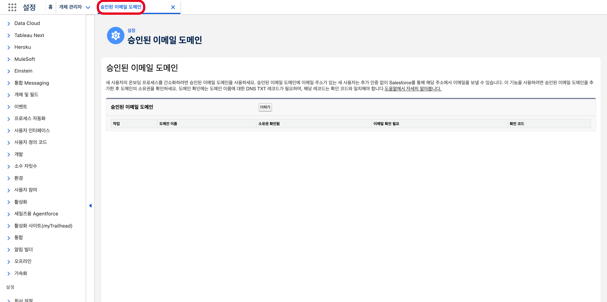
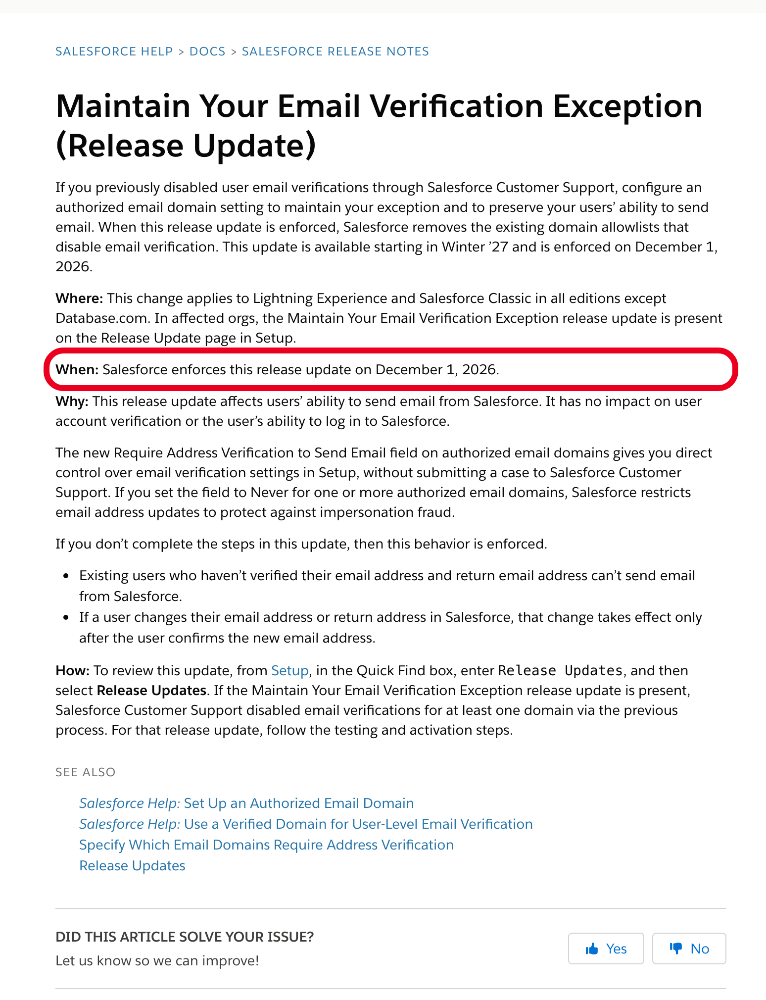

# NewsCard — Salesforce 릴리스를 카드뉴스로, 확인할 자리는 ORG 화면

릴리스 노트·릴리스 업데이트를 자동으로 모아, 기준 org에서 그 화면을 찾아 캡처하고, 봐야 할 자리에 빨간 테두리를 쳐서 카드·Slack으로 보내는 도구입니다.

| ① 카드뉴스 | ② 릴리스 업데이트 목록에서 이번 항목 | ③ 조치할 Setup 화면에서 봐야 할 자리 |
|---|---|---|
|  |  |  |

*같은 릴리스 업데이트 한 건입니다. 카드가 소식을 요약하고, 캡처 두 장이 데모 org(SDO)에서 그 항목과 조치할 Setup 메뉴 자리를 빨간 테두리로 가리킵니다. 로고와 사용자 아바타가 있는 상단 헤더는 잘라 냈습니다.*

| 항목 | 내용 |
|---|---|
| 기간 | 2026.07 ~ 진행 중 |
| 역할 | 개인 프로젝트 — 설계·구현·운영 |
| 스택 | Node.js, puppeteer-core, sf CLI, Python, Slack API, Instagram Graph API |

## 목적

릴리스 업데이트는 관리자가 아무것도 안 하면 정해진 시점에 자동 적용됩니다. 릴리스 노트는 무엇이 바뀌는지 알려 주지만, 우리 org의 어느 화면을 확인해야 하는지는 보여 주지 않습니다.
그래서 사람이 Setup을 뒤져 그 자리를 찾아야 했습니다. 이 도구는 그 찾는 일을 없앱니다. 카드에 요약을 담고, 스레드에 빨간 테두리를 친 org 화면 캡처를 붙입니다.
조치할 Setup 화면 캡처가 없으면 카드를 보내지 않습니다. 빈도 목표는 없고, 변화가 있는 날에만 보냅니다.

## 파이프라인


릴리스 수집 → org 화면 탐색·캡처 → 빨간 테두리 → 카드 → 발송 흐름입니다. 점선 상자는 이 저장소에 없는 코드입니다.

## 워크스루

**① 수집** — 공식 릴리스 노트·릴리스 업데이트와 기준 org의 Tooling API `ReleaseUpdate`를 읽습니다.<br>
판단: 문서가 말하는 것과 org에 와 있는 것은 다를 수 있어, 강제 시점과 상태를 org 실물로 대조합니다.

<details><summary>자세히</summary>

**하는 일.** 세 곳을 읽습니다. `bin/fetch-release-updates.mjs`는 공식 릴리스 노트 인덱스에서 제목이 "(Release Update)"로 끝나는 링크를 뽑습니다. `bin/fetch-release-notes.mjs`는 항목 본문의 What·Where·When·Why·How 블록을 뽑습니다. `bin/fetch-org-release-updates.mjs`는 기준 org의 Tooling API `ReleaseUpdate`를 sf CLI로 조회합니다.

**쓴 기술.** help.salesforce.com은 Aura SPA라 HTML 셸에 본문이 없습니다. 헤드리스 Chrome을 띄워 두고 페이지를 동시에 4개씩 렌더합니다(`bin/lib/chrome.mjs`). 본문 텍스트 길이가 안정될 때까지 폴링합니다. org 쪽은 Chrome 없이 sf CLI 세션만 씁니다.

**판단.** 문서가 말하는 것과 org에 실제로 와 있는 것은 다를 수 있습니다(연기·조기 적용·org별 차이). 그래서 강제 시점과 상태를 org 실물로 대조합니다. 강제 시점은 When 절 안에서만 찾습니다. 본문 전체를 훑으면 지난 릴리스 문구를 잡습니다. When 절에 시점이 없으면 카드에도 시점을 쓰지 않습니다.

릴리스 노트에 안 실리는 변화도 있습니다. `bin/fetch-ui-surfaces.mjs`는 화면 컨트롤을, `bin/fetch-permission-surfaces.mjs`는 사용자 권한 필드 목록을 org에서 직접 diff 합니다.

</details>

**② 판별과 브리프** — 이전 스냅샷과 비교해 추가·제목 변경·사라짐을 가르고, 통과한 항목을 JSON 브리프로 만듭니다.<br>
판단: 목록에서 빠진 릴리스 업데이트는 대개 철회가 아니라 적용이 끝났거나 릴리스가 넘어간 것입니다. 이미 보냈거나 큐에 든 항목만 정정 대상으로 올립니다.

<details><summary>자세히</summary>

**하는 일.** 이전 스냅샷과 비교해 추가·제목 변경·사라짐을 가릅니다. 카드 후보는 대기 큐(`bin/lib/pending.mjs`)에 쌓습니다. 판정을 통과한 항목은 JSON 브리프가 되고, `templates/card-brief.js`가 필수 필드·출처 도메인을 검사합니다.

**쓴 기술.** 스냅샷 diff, `source::type::key` 복합 키 누적 큐, 임시 파일에 쓰고 rename 하는 원자적 쓰기.

**판단.** 릴리스 업데이트가 목록에서 빠지는 것은 대개 뉴스가 아닙니다. 적용이 끝났거나 릴리스가 넘어간 것입니다. 철회로 보내면 오보입니다. 예외는 이미 카드로 보냈거나 큐에 든 항목입니다. 그 근거가 org에서 사라지면 정정이 필요하므로 큐에 올립니다. 제목만 바뀐 항목도 신규가 아니라 "바뀐 항목"으로 둡니다. 본문이 같이 바뀌었을 수 있어서입니다.

</details>

**③ Setup 화면 찾기** — 기준 org에서 릴리스 노트 How 절이 가리키는 Setup 경로를 엽니다.<br>
판단: 실사용 org는 캡처에 쓰지 않습니다. 즐겨찾기·검색 결과에 고객명이 찍히기 때문입니다.

<details><summary>자세히</summary>

**하는 일.** `bin/capture-annotated.mjs <org> "<찾을 문구>" <out.png> [setup-path]`가 기준 org의 Setup 경로를 엽니다. 기본 경로는 릴리스 업데이트 목록(`/lightning/setup/ReleaseUpdates/home`)입니다. 조치 화면은 릴리스 노트 How 절이 가리키는 Setup 경로를 인자로 넣습니다.

**쓴 기술.** `sf org open --url-only`로 로그인 URL을 받아 바로 씁니다. 이 URL은 몇 분만 지나도 로그인 화면으로 떨어집니다. Lightning 목록은 lazy render라 가장 큰 스크롤 컨테이너를 끝까지 훑어 카드를 DOM에 올립니다. 클래식 Setup 페이지는 iframe이라 메인 프레임에서 못 찾으면 프레임을 순회합니다.

UI 표면 감시는 한 단계 더 합니다. LWC 컴포넌트는 shadow root 안에 그려져 `querySelectorAll`이 못 봅니다. shadowRoot를 재귀로 내려가며 컨트롤 라벨·placeholder·버튼 텍스트를 모읍니다.

**판단.** 기준 org는 세 갈래로 둡니다. 매일 새로 만드는 scratch org는 사용자 상태가 0이라 순수 플랫폼 변화만 잡습니다. 라이선스 기능이 보이는 데모 org와 고객 org 급 테스트 org는 조회만 합니다. 두 org의 차집합이 "아직 도착하지 않은 기능" 목록입니다. 실사용 org는 캡처에 쓰지 않습니다. 즐겨찾기·검색 결과에 고객명이 찍히기 때문입니다.

</details>

**④ 캡처 + 빨간 테두리** — 찾을 문구가 든 요소에 빨간 테두리를 그리고 세로 1100×1500으로 찍습니다.<br>
판단: "문구 못 찾음"은 화면에 없다는 근거가 아니라서, 못 찾으면 exit 3으로 끝내고 org 화면 언어를 같이 찍습니다.

<details><summary>자세히</summary>

샘플 세 장을 단계 자리에 넣었습니다. ③단계의 결과는 맨 위 대표 이미지(릴리스 업데이트 목록, 다른 항목)입니다. ④·⑤의 두 장은 같은 주제(승인된 이메일 도메인)입니다. 테스트·데모 org와 공개 문서 페이지에서 찍었습니다.

**하는 일.** 찾을 문구가 든 요소에 빨간 테두리를 그리고 화면을 찍습니다. 세로 1100×1500, 배율 2로 찍습니다. Instagram 슬라이드가 세로라 가로 캡처를 넣으면 글자가 너무 작아지기 때문입니다.



*조치할 Setup 화면(설정 ▸ 이메일 ▸ 승인된 이메일 도메인)입니다. 항목이 아직 org에 오기 전이라 경로가 맞는 화면의 현재 모습을 찍었습니다. 상단 전역 헤더와 아래쪽 빈 영역은 잘라 냈습니다.*

**쓴 기술.** 텍스트 노드에서 시작해 부모로 올라가며 카드 크기(폭 400~1100px, 높이 120~800px)에 드는 조상을 고릅니다. 그 요소에 CSS `outline`을 주입합니다. 이미지 후처리가 아니라서 의존성이 없습니다. 문구는 공백을 접어 비교합니다. Lightning이 라벨을 줄바꿈·들여쓰기와 함께 렌더해서입니다.

테두리가 조상의 overflow에 잘리면 네모가 두 줄로만 남습니다. 내용이 넘치지 않는 클리퍼는 overflow를 풀고, 스크롤 중인 컨테이너는 건드리지 않습니다. 그래도 잘릴 자리면 테두리를 요소 안쪽에 그립니다.

변경 감지 쪽은 `bin/fetch-ui-surfaces.mjs`가 맡습니다. 표면마다 컨트롤 텍스트 시그니처를 뜨고 직전 스냅샷과 비교합니다. 변화가 있으면 그 화면 캡처와 diff를 증거 폴더에 저장하고 카드 후보로 올립니다.

**판단.** "문구 못 찾음"은 화면에 없다는 근거가 아닙니다. 그래서 못 찾으면 exit 3으로 끝내고, org 화면 언어를 같이 찍습니다. 아래 「설계 판단」에 이 규칙이 생긴 경위를 적었습니다.

</details>

**⑤ 문서 문단 캡처** — org에 아직 안 온 항목은 릴리스 노트 원문 문단에 빨간 네모를 쳐 찍습니다.<br>
판단: 렌더 실패(exit 2)와 매칭 실패(exit 3)를 가려, 원문이 바뀐 건지 도구가 못 찾은 건지 구분합니다.

<details><summary>자세히</summary>

**하는 일.** org에 아직 안 온 항목은 `bin/capture-docpage.mjs "<url>" "<찾을 문구>" <out.png>`로 릴리스 노트 원문을 찍습니다. "우리가 읽은 원문이 이것"임을 보이는 증거입니다. 로그인이 없는 공개 페이지라 sf CLI를 타지 않습니다.



*같은 이메일 도메인 주제의 릴리스 업데이트 원문입니다. When 절에 빨간 네모를 쳤고, 왼쪽 목차를 빼고 본문 칸만 잘라 찍었습니다.*

**쓴 기술.** 문구가 실제로 그려질 때까지 기다립니다. 쿠키 배너는 동의 버튼을 누르지 않고 DOM에서 치웁니다. 문단은 목록 카드보다 작아 크기 창을 높이 20~260px, 폭 300~1300px로 낮췄습니다. 하한이 40px이면 한 줄짜리 When 문단을 건너뛰고 article 전체가 잡혔습니다. 문구가 링크·강조 태그로 쪼개져 있으면 그 문구를 품은 가장 작은 요소를 고릅니다.

본문 칸의 좌표를 DOM에서 돌려받아 clip으로 씁니다. 화면 폭에 닿기 직전까지 넓은 조상이 본문 칸입니다. 왼쪽 목차는 길찾기 장치라 증거에서 뺍니다.

**판단.** 렌더 실패(exit 2)와 매칭 실패(exit 3)를 가릅니다. 둘이 같은 메시지였을 때는 원문이 바뀐 건지 도구가 못 찾은 건지 구분이 안 됐습니다.

</details>

**⑥ 카드 만들기** — 브리프로 이미지 모델 프롬프트를 조립하고, 판형을 맞춘 뒤 실물 SVG 로고를 코드가 얹습니다.<br>
판단: 이미지 모델은 로고를 제대로 그리지 못해서, 로고는 코드가 합성합니다.

<details><summary>자세히</summary>

**하는 일.** 브리프로 이미지 모델 프롬프트를 조립합니다(`templates/card-layout.js`). 생성된 이미지를 판형에 맞추고(`bin/lib/fit-event-card.py`), 실물 SVG 로고를 코드가 얹습니다(`bin/compose-logos*.mjs`).

**판단.** 이미지 모델은 로고를 제대로 그리지 못합니다. 그래서 로고는 코드가 합성합니다. 판형을 정한 과정은 아래 「판형 변천」에 적었습니다.

</details>

**⑦ Slack·Instagram 발송** — 같은 PNG를 Slack 채널과 Instagram 캐러셀에 올리고, Slack 스레드에 캡처를 붙입니다.<br>
판단: 두 채널에 따로 만든 판을 보내지 않습니다. 판형 규칙이 하나라 검증도 한 번입니다.

<details><summary>자세히</summary>

**하는 일.** 같은 PNG를 Slack 채널과 Instagram 캐러셀에 올립니다. Slack에는 카드와 같은 호출로 캡처를 스레드에 붙입니다.

**쓴 기술.** 보낸 항목의 키를 발송 이력에 남기고, 다음 렌더에서 Set으로 거릅니다(`bin/render-cards.mjs`의 `itemKey`).

**판단.** 두 채널에 따로 만든 판을 보내지 않습니다. 판형 규칙이 하나라 검증도 한 번입니다. 발송 스크립트는 계정 식별자가 들어 있어 이 저장소에 넣지 않았습니다.

</details>

## 판형 변천

| 아침 판 (2:3) | 새 표지 골격 (2:3, 크롭 전) | v5 표지 (4:5) |
|---|---|---|
|  |  |  |

- **이벤트 레인 분기(2026.09)** — 매일 카드의 규율(2색, 로고 금지)이 행사 소식에 맞지 않아, 행사 카드를 절차 문서와 형제 스크립트로 빼고 메인의 행사 분기는 동결했습니다.
- **표지** — 카드가 아니라 첫 장이 문제여서, 표지를 카드 목차에서 그날 발표 전부를 담는 2×3 그리드로 바꿨습니다.
- **v3** — 제품 카드는 아침 카드의 문장·숫자·섹션을 지키고 표지 톤만 가져왔으며, 글자 크기는 행 수가 정하므로 행 수를 10~11로 맞춥니다.
- **v4** — 매일 첫 슬라이드를 키노트로 고정하고 번호 절·인용·발표자 초상을 넣었습니다.
- **v5** — 인스타 4:5 판형에 맞추고, 출처·날짜는 이미지가 아니라 캡션에 넣습니다.

<details><summary>자세히</summary>

### 이벤트 레인 분기 (2026.09)

처음에는 행사 카드도 매일 도는 변경 카드와 같은 파이프라인을 탔습니다. 같은 검증기, 같은 프롬프트 조립기였습니다.
그 규율(2색, 로고 금지)은 전부 매일 카드 맥락에서 나온 것이라 행사 소식에 맞지 않았습니다.

그래서 먼저 갈랐습니다. 다만 코드 분기로 가르지는 않았습니다. 1년에 한 번 하는 행사를 if문으로 넣으면 메인 파이프라인이 무거워집니다.
2026-09-18에 행사 카드를 절차 문서 하나와 형제 스크립트로 뺐습니다. 메인의 행사 분기는 동결했습니다. 늘리지도 빼지도 않습니다.
행사 세트는 표지·키노트·제품 카드 세 골격으로 만들고, 인스타 4:5 판형으로 냅니다.

### Dreamforce '26 DAY 1 세트

v3·v4·v5는 이벤트 레인에서 2026-09-18 하루 동안 DAY 1 세트를 다시 만들며 붙인 반복 번호입니다. 도구 전체의 버전이 아닙니다.

**아침 판.** 분기 전 파이프라인으로 만든 판입니다. 표지는 날짜와 카드 목록뿐이었습니다. 포맷이 너무 정형화돼 보는 사람도, 만든 사람도 재미가 없었습니다.

**카드가 아니라 첫 장이 문제였습니다.** 참고 골격으로 제품 카드를 한 장 만들어 보고 나서야 초점이 잡혔습니다. 표지는 우리가 만든 카드의 목차가 아니라 그날 발표 전부를 담습니다. 카드는 첫 장에서 다 보여준 내용의 디테일입니다. 그래서 표지를 2×3 그리드로 바꿨고, 카드 수는 줄이지 않았습니다.

**v3 — 제품 카드는 내용을 잃지 않습니다.** 표지 문법(짧은 라벨·픽토그램·아바타)을 제품 카드에 씌운 판은 "너무 유치하다, 내용이 너무 없다"는 판정으로 버렸습니다. 아침 카드의 문장·숫자·섹션은 그대로 두고 표지의 톤(파스텔·색 띠·실물 로고)만 가져왔습니다.

**v4 — 키노트는 첫 장에, 다른 레이아웃으로.** 매일 첫 슬라이드는 키노트로 고정하고 01~06 번호 절·인용·발표자 초상을 넣었습니다. 순서는 표지 → 키노트 → 제품 카드입니다.

**v5 — 인스타 4:5 판형.** 인스타 피드는 세로 4:5가 상한이라 2:3 카드는 위아래가 잘립니다. 내용은 4:5 안전영역 안에 두고 스크립트가 1024×1280으로 맞춥니다. 출처·날짜는 이미지가 아니라 캡션에 넣습니다. 가운데 그림의 하단 "출처" 줄과 상단 날짜가 v5에서 빠진 이유입니다.

| v4 키노트 골격 (v5 판형) | v3 제품 카드 톤 (v5 판형) |
|---|---|
|  |  |

**슬라이드를 넘길 때 글자 크기가 다르면 통일성이 없습니다.** 원인을 재 보니 행 수였습니다. 판형 맞춤이 내용을 1280px에 채우므로 10행 카드는 섹션 헤더 글자가 35px, 14행 카드는 30px이 됩니다. 프롬프트에 px 값을 박아도 움직이지 않았습니다. 그래서 규칙은 "제품 카드 행 수를 10~11로 맞춘다"가 됐습니다.

</details>

## 실물 검증

판형 판단을 두 번 틀렸고, 두 번 다 실물로 잡았습니다. 크롭 단계는 실물 확인 없이 뺐다가 새 세트 첫 장이 피드에서 잘렸습니다.
글자 크기는 옅은 띠 색을 글자로 잡아 32~55px로 오측했고, 다시 재니 30~35px였습니다.
그래서 **판형은 실물로 검증합니다.** 코드와 문서가 말하는 크롭 규칙보다 실제 게시물의 픽셀이 우선입니다.

<details><summary>자세히</summary>

첫째는 크롭입니다. 인스타가 2:3을 4:5로 자른다고 코드 근거로 추론해 크롭 단계를 넣었습니다. "오늘 올린 건 안 잘렸다"는 말을 듣고 실물 확인 없이 그 단계를 뺐습니다. 그 판형으로 올린 새 세트의 첫 장이 피드에서 잘렸습니다. 픽셀로 재 보니 아침 표지도 잘리는 띠에 글자가 걸려 있었습니다. 덜 눈에 띄었을 뿐이었습니다.

둘째는 글자 크기입니다. 섹션 헤더 띠의 글자 높이를 재서 32~55px로 벌어져 있다고 봤습니다. 이 값은 옅은 띠 색을 글자로 잡은 오측이었습니다. 다시 재니 30~35px였고, 원인은 위에 적은 행 수였습니다.

게시한 Instagram 미디어는 이미지를 바꿀 수 없어서, 잘린 게시물은 지우고 다시 올렸습니다.

</details>

## 결과

- 평일 릴리스 카드는 변화가 있는 날에 발행하고, 스레드에 목록 화면과 조치 화면 두 장의 빨간 테두리 캡처를 붙입니다.
- org에 아직 안 온 예고 항목은 원문 문단 캡처와 조치 화면의 현재 모습을 붙이고, 도착한 날 실제 화면을 같은 스레드에 덧붙입니다.
- Dreamforce '26 세 날 세트를 v5 판형으로 Instagram에 게시했습니다: [DAY 1 — 10장](https://www.instagram.com/p/DdbRyjrE7CS/) · [DAY 2 — 6장](https://www.instagram.com/p/DdbVpFtE_Dj/) · [DAY 3 — 10장](https://www.instagram.com/p/DdbV4H3Eyf3/)

<details><summary>DAY 3 카드 보기</summary>

| DAY 3 표지 (v5) | DAY 3 제품 카드 (v5) |
|---|---|
|  |  |

</details>

## 설계 판단

- **org 실물 화면을 증거로 씁니다.** 문서 링크만으로는 어디를 열어야 하는지 모르고, 문서와 org가 다를 때도 있습니다.
- **빨간 테두리 좌표는 DOM에서 잡습니다.** 문구로 찾은 요소에 outline을 주면 레이아웃이 바뀌어도 테두리가 따라갑니다.
- **"못 찾음"은 "없음"이 아닙니다.** 부재를 주장할 때는 반드시 있는 문구(양성 대조)를 같은 실행에 같이 던집니다.

<details><summary>자세히</summary>

**org 실물 화면을 증거로 씁니다.** 문서 링크만 걸면 독자는 무엇이 바뀌는지는 알아도 어디를 열어야 하는지는 모릅니다. 문서와 org가 다를 때도 있습니다. 강제 시점이 미뤄지거나, 항목이 org에서 조용히 사라지기도 합니다. 그래서 카드의 근거는 기준 org에 실제로 떠 있는 화면입니다.

**빨간 테두리 좌표는 DOM에서 잡습니다.** 스크린샷 위에 사각형을 그리려면 좌표를 따로 알아야 합니다. 브라우저는 요소 위치를 이미 알고 있습니다. 문구로 요소를 찾고 그 요소에 outline을 주면 레이아웃이 바뀌어도 테두리가 따라갑니다. outline은 박스 크기를 바꾸지 않아 화면이 밀리지 않습니다.

**"못 찾음"은 "없음"이 아닙니다.** 같은 URL·같은 org에서 같은 권한 문구를 한 번은 놓치고 한 번은 잡은 적이 있습니다. 클래식 iframe 목록이 느리게 그려져 앞부분만 DOM에 올라온 실행이 있었습니다. 첫 결과만 믿었다면 "그 설정은 UI에 없다"는 틀린 사실을 카드에 실었을 것입니다. 여기서 규칙을 얻었습니다. 부재를 주장할 때는 반드시 있는 문구(양성 대조)를 같은 실행에 같이 던집니다. 대조 문구가 잡힌 실행에서 대상이 안 잡혔을 때만 "없음"으로 판정합니다.

같은 부류의 원인이 두 가지 더 있었습니다. 하나는 언어입니다. 릴리스 노트는 영어로 받는데 한국어 org의 화면 라벨은 한국어라, 문서 문구로는 영영 안 걸립니다. 그래서 못 찾으면 org 언어를 같이 출력합니다. 다른 하나는 공백입니다. 화면에 멀쩡히 있는 문구가 줄바꿈 때문에 안 걸렸습니다. 이제 비교는 전부 공백을 접어서 합니다.

**라벨이 아니라 구조로 비교합니다.** org끼리 화면을 비교할 때 라벨은 언어를 탑니다. 라벨로 비교하니 전 표면이 "라이선스 전용"으로 나왔습니다. 링크 경로·버튼 name·표준 버튼 식별자처럼 언어를 안 타는 값으로 비교하고, 모든 표면에 공통인 헤더·유틸리티 바를 뺐습니다. 후보가 103개에서 6개로 줄었고 남은 6개는 전부 진짜였습니다.

**세 골격.** 행사 카드는 표지(그날 발표 전부 2×3 그리드)·키노트(번호 절과 발표자)·제품 카드(문장 행과 색 띠) 세 골격으로 나눕니다. 행사는 1년에 한 번이라 메인 파이프라인에 if문을 늘리지 않았습니다. 절차 문서와 형제 스크립트(`bin/compose-logos-event.mjs`)로 뺐고, 메인의 행사 분기는 동결했습니다.

**글자 크기는 행 수가 정합니다.** 판형 맞춤이 내용 높이를 캔버스에 채우므로 행이 많을수록 글자가 작아집니다. 크기를 프롬프트로 지시하지 않고 행 수로 묶습니다.

**인물 일러스트는 키노트만.** 발표자 초상은 키노트 카드에만 둡니다. 제품 카드에는 아바타·목업을 넣지 않습니다. 제품 카드는 내용이 주인공입니다.

**Slack과 Instagram이 같은 파일을 씁니다.** 4:5로 맞추고 로고를 얹은 PNG 하나를 양쪽에 올립니다. 캡처도 목적지별로 따로 만들지 않습니다. 세로로 한 장 찍어 두 곳이 같은 증거를 봅니다.

</details>

## 적용한 개념

- **텍스트 노드 → 크기 창 조상 승격** — 문구를 품은 텍스트 노드에서 부모로 올라가며 크기 창에 드는 첫 조상을 고릅니다(`bin/capture-annotated.mjs`).
- **Shadow DOM 재귀 수집** — `shadowRoot`가 있는 요소마다 내려가 LWC 안의 컨트롤을 모읍니다(`bin/fetch-ui-surfaces.mjs`).
- **스냅샷 diff와 실패 보존** — 수집에 실패한 표면은 이전 시그니처를 둡니다. 화면이 안 뜬 것과 컨트롤이 사라진 것은 다릅니다(`bin/lib/ui-surface.mjs`).

<details><summary>자세히</summary>

**텍스트 노드 → 크기 창 조상 승격** — `bin/capture-annotated.mjs`, `bin/capture-docpage.mjs`. TreeWalker로 텍스트 노드를 훑어 문구를 찾고, 부모로 최대 8~10단계 올라가며 크기 창에 드는 첫 조상을 고릅니다. div 래퍼를 바로 잡으면 body 급으로 새는 사고가 있어서 폭 상한을 넘으면 멈춥니다. 작은 대상(카운터 등)은 리프 부모를 그대로 씁니다.

**Shadow DOM 재귀 수집** — `bin/fetch-ui-surfaces.mjs`의 `DEEP_WALK`. 문서에서 시작해 `shadowRoot`가 있는 요소마다 내려갑니다. 방문 집합으로 순환을 막습니다. 모든 프레임에 같은 스크립트를 돌립니다.

**셀렉터 모드 두 가지** — scratch org는 시드 이름이 고정이라 데이터까지 봅니다(`full`). 조회 전용 org는 레코드명·콘솔 탭이 매일 달라져 컨트롤만 봅니다(`controls`: button·input·menuitem·option).

**스냅샷 diff와 실패 보존** — `bin/lib/ui-surface.mjs`의 `diffSurfaces`, `bin/fetch-ui-surfaces.mjs`. 수집에 실패한 표면은 이전 시그니처를 그대로 둡니다. 화면이 안 뜬 것과 컨트롤이 사라진 것은 다릅니다. 로딩 스피너가 보이는 동안은 시그니처를 뜨지 않습니다. 숫자는 `#`로 마스킹하고, 레코드 ID와 origin은 지웁니다.

**본문 칸 좌표로 clip** — `bin/capture-docpage.mjs`. 테두리를 친 문단에서 위로 올라가며 화면 폭의 90%를 넘지 않는 가장 넓은 조상을 본문 칸으로 잡고, 그 `getBoundingClientRect()`를 스크린샷 clip으로 씁니다. `bin/capture-web.mjs`는 뷰포트 좌표에 스크롤 오프셋을 더해 문서 좌표로 바꿉니다.

**병렬 수집, 순차 판정** — `bin/fetch-ui-surfaces.mjs`. 세 org 수집은 서로 독립이라 `Promise.all`로 동시에 돌립니다. 게이트·미도착 판별은 다른 트랙을 기준선으로 쓰므로 수집이 다 끝난 뒤 순서대로 합니다.

**복합 키 + Set으로 멱등 발송** — `bin/render-cards.mjs`의 `itemKey`. 키는 `항목::이벤트` 형태이고, 일정 변경은 바뀐 값까지 키에 넣습니다. 같은 항목이 나중에 철회되거나 일정이 또 바뀌면 새 소식으로 다시 나갑니다. 미리보기·재발송은 `--ignore-sent` 플래그로 합니다.

**소스별 큐 라운드로빈** — 블로그 카드는 한 장 상한이 있습니다. 날짜순으로만 자르면 발행량이 많은 소스가 상한을 다 먹습니다(실측 9건 중 한 소스 8건). 소스별 큐에서 한 건씩 번갈아 뽑은 뒤 카드 안에서는 다시 최신순으로 정렬합니다.

**누적 대기 큐와 원자적 쓰기** — `bin/lib/pending.mjs`, `bin/lib/io.mjs`. 하루 창 diff는 주말 수집에 덮어써집니다. 그래서 후보를 `source::type::key`로 누적하고, 같은 키가 다시 오면 `firstSeen`은 지키고 데이터만 갱신합니다. JSON은 임시 파일에 쓰고 rename합니다. 깨진 큐는 빈 큐로 덮지 않고 `.corrupt`로 옮겨 보존합니다.

**내용 경계 탐색 후 크롭/축소 분기** — `bin/lib/fit-event-card.py`. 모서리 픽셀을 배경색으로 잡고 위·아래에서 행 단위로 스캔합니다. 내용 높이가 1280px 이하면 글자 크기 그대로 잘라 내고, 넘치면 비율을 유지해 LANCZOS로 줄입니다.

**멱등 로고 합성** — `bin/compose-logos.mjs`. 합성 전 원본을 `.raw.png`로 남기고 늘 원본에서 합성합니다. 두 번 돌려도 로고가 겹치지 않습니다.

</details>

## 실행 방법

Chrome·sf CLI 로그인·Slack/Instagram 토큰이 필요합니다.

<details><summary>실행 방법</summary>

필요한 것:

- Node.js(22에서 확인), Python 3 + Pillow
- 시스템 Chrome — puppeteer-core는 브라우저를 내려받지 않습니다. 경로가 다르면 `NEWSCARD_CHROME`에 적습니다.
- sf CLI와 로그인한 org — 기준 org는 sf CLI로 로그인한 org입니다. 스크립트는 sf CLI 세션만 쓰고 자격 증명을 저장하지 않습니다.
- `.env.example`의 변수 — org 별칭(`SF_TARGET_ORG` 등), 데이터 경로, Slack 발송 이력 대조용 값

```bash
npm install
sf org login web --alias my-org          # 기준 org 로그인 (한 번)
export SF_TARGET_ORG=my-org

# 릴리스 수집
node bin/fetch-release-updates.mjs
node bin/fetch-org-release-updates.mjs --grep "Email"

# 릴리스 업데이트 목록에서 대상 카드에 빨간 테두리
node bin/capture-annotated.mjs my-org "Adopt Authorized Email Domains" out/ru.png

# 조치할 Setup 화면
node bin/capture-annotated.mjs my-org "<화면 라벨>" out/setup.png /lightning/setup/<경로>/home

# 릴리스 노트 문단에 빨간 네모 (로그인 불필요)
node bin/capture-docpage.mjs "<릴리스 노트 URL>" "<When 절 문구>" out/doc.png

node --test tests/*.test.mjs
```

찾을 문구는 org 화면 언어로 씁니다. 한국어 org에는 한국어 라벨을 넣습니다.

수집 결과는 기본으로 `content/`와 `out/`에 씁니다. 둘 다 `.gitignore`에 있습니다. 다른 곳에 두려면 `NEWSCARD_CONTENT_DIR`·`NEWSCARD_OUT_DIR`을 씁니다.

`bin/fetch-ui-surfaces.mjs`와 `bin/probe-release-update.mjs`는 scratch org를 만들므로 Dev Hub가 필요합니다(`SF_DEVHUB`, 없으면 sf 기본 Dev Hub). `bin/probe-release-update.mjs`는 그 scratch org에 Apex 클래스와 Settings를 배포합니다. 운영 org를 대상으로 쓰지 않습니다. 나머지 org 스크립트는 조회만 합니다.

솔직히 적습니다. 카드 렌더는 브리프가 있어야 돌고, 발송은 Slack·Instagram 토큰이 있어야 합니다. 이 발췌본에서 테스트는 115건 중 102건이 통과합니다. 실패 13건 중 11건은 원본 저장소에서도 같은 상태로 실패하는 테스트입니다. 나머지 2건은 이 저장소에 넣지 않은 브리프 파일과 스크립트를 읽습니다.

`integrations/launchd/*.plist.example`은 평일 예약 실행 예시입니다. 경로를 바꿔 씁니다. 이 파일이 부르는 `bin/run.sh`는 넣지 않았습니다.

</details>

## 이 저장소에 없는 것

- 수집 스냅샷·카드 브리프·발행 이력, 토큰, 제3자 로고 파일(`assets/logo/README.md`에 둘 자리만 적었습니다)
- 발송 스크립트(Slack·Instagram, 계정 식별자 포함), 블로그·행사·폐기 목록 수집기, 전체 루틴을 부르는 `bin/run.sh`
- 실사용 org 화면 캡처 — 샘플은 테스트·데모 org와 공개 문서 페이지에서 찍었고, 로고·아바타가 있는 상단 헤더를 잘라 냈습니다
