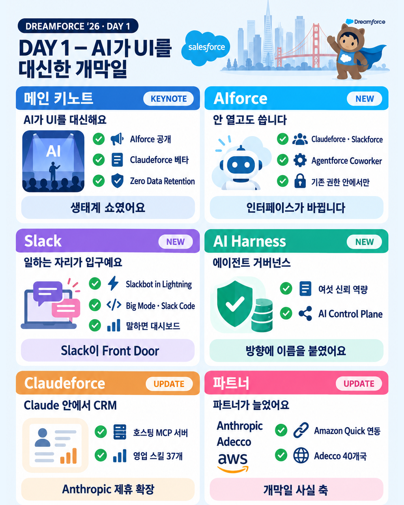
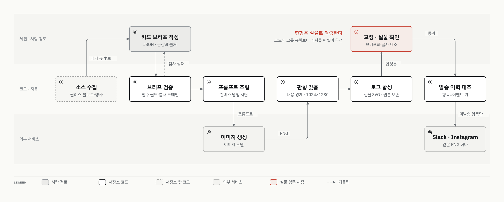
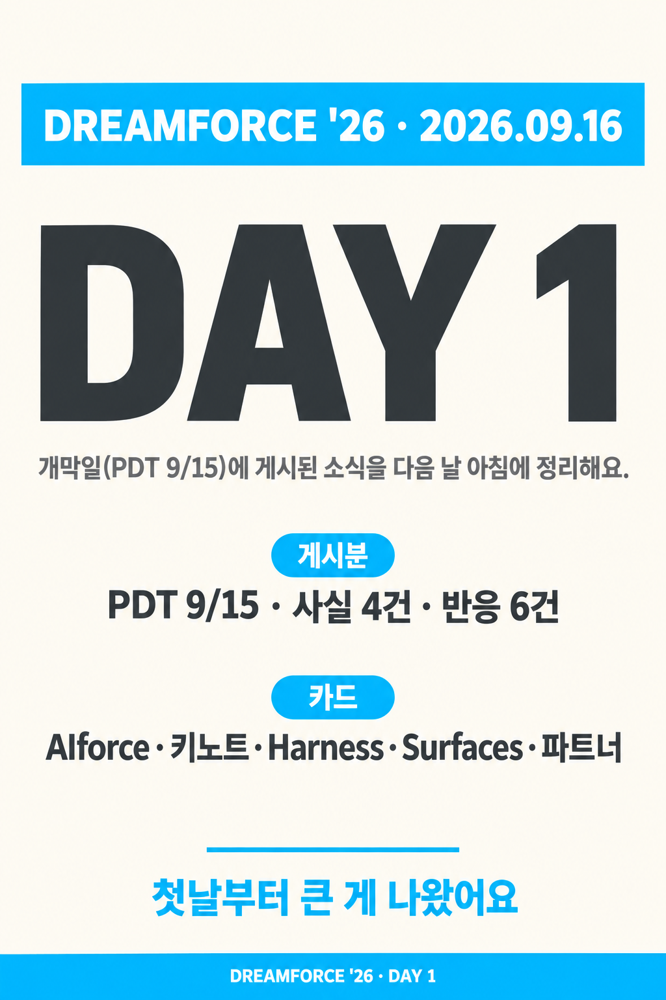
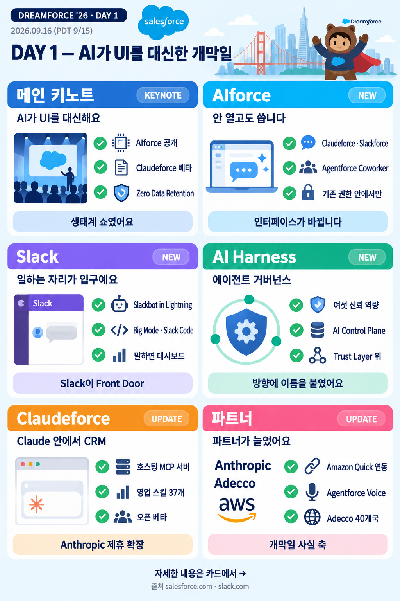
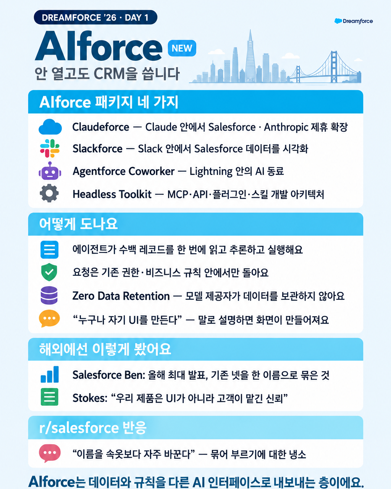
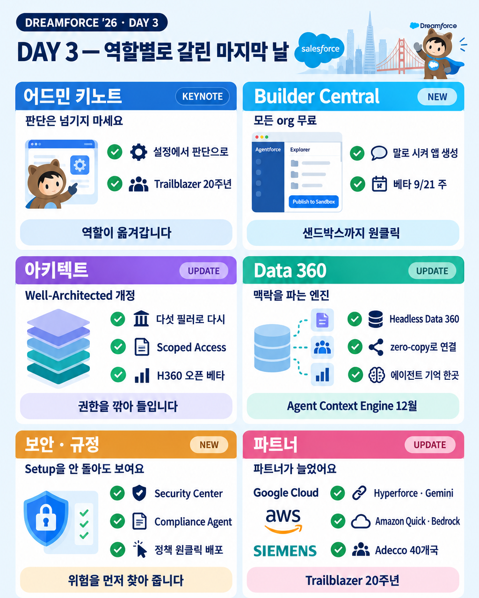
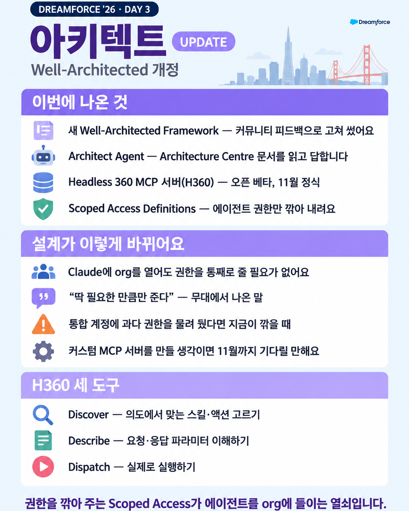

# NewsCard

Salesforce 릴리스·행사 소식을 한국어 카드뉴스로 만들어 Slack과 Instagram에 보내는 개인 자동화 도구입니다.



| 항목 | 내용 |
|---|---|
| 기간 | 2026.07 ~ 진행 중 |
| 역할 | 개인 프로젝트 — 설계·구현·운영 |
| 스택 | Node.js, puppeteer-core, Python, Slack API, Instagram Graph API |

## 목적

Salesforce는 릴리스마다 기능을 바꾸고, 폐기하고, 이름을 바꿉니다. 공식 폐기 목록은 조용히 수정되기도 합니다.
이 변화를 카드 한 장으로 요약해 공유하려고 만들었습니다.

빈도 목표는 두지 않았습니다. 변화가 있는 날에만 보냅니다. 억지로 채운 카드는 읽히지 않는다고 판단했습니다.
카드는 요약을 담고 혼자 읽혀야 합니다. 외부 문서 링크만 걸어 두는 방식은 버렸습니다.

## 파이프라인



아래 1~5단계를 코드 단위로 나눈 흐름입니다. 점선 상자는 이 저장소에 없는 코드입니다.

1. **소스 수집** — 공식 폐기 목록, Release Update, 릴리스 노트, 공식 블로그, 행사 소식을 스냅샷으로 모읍니다. 이전 스냅샷과 비교해 추가·철회·일정 변경을 찾습니다.
2. **카드 브리프** — 카드 한 장의 내용을 JSON 브리프로 씁니다. `templates/card-brief.js`가 필수 필드·출처 도메인·팔레트·로고 슬러그를 검사합니다.
3. **렌더(판형 맞춤)** — 브리프로 이미지 모델 프롬프트를 조립합니다(`templates/card-layout.js`). 생성된 이미지를 판형에 맞춥니다. 행사 카드는 `bin/lib/fit-event-card.py`가 1024×1280(4:5)으로 맞춥니다.
4. **로고 합성** — 이미지 모델은 로고를 제대로 그리지 못합니다. 실물 SVG 로고를 코드가 카드 위에 얹습니다(`bin/compose-logos*.mjs`).
5. **발송** — 같은 PNG를 Slack 채널과 Instagram 캐러셀에 올립니다. 보낸 항목은 발송 이력에 남겨 다시 보내지 않습니다.

이 저장소에는 2~4단계 코드와 발송 이력 대조 로직이 있습니다. 1단계 수집기와 5단계 발송 스크립트는 넣지 않았습니다(아래 「이 저장소에 없는 것」).

## 판형 변천

### 이벤트 레인 분기 (2026.09)

처음에는 행사 카드도 매일 도는 변경 카드와 같은 파이프라인을 탔습니다. 같은 검증기, 같은 프롬프트 조립기였습니다.
그 규율(2색, 로고 금지, 브릭 마스코트 제외)은 전부 매일 카드 맥락에서 나온 것이라 행사 소식에 맞지 않았습니다.

그래서 먼저 갈랐습니다. 다만 코드 분기로 가르지는 않았습니다. 1년에 한 번 하는 행사를 if문으로 넣으면 메인 파이프라인이 무거워집니다.
2026-09-18에 행사 카드를 절차 문서 하나와 형제 스크립트로 뺐습니다. 메인의 행사 분기는 동결했습니다. 늘리지도 빼지도 않습니다.
행사 세트는 표지·키노트·제품 카드 세 골격으로 만들고, 인스타 4:5 판형으로 냅니다.

### Dreamforce '26 DAY 1 세트

아래 v3·v4·v5는 이벤트 레인에서 2026-09-18 하루 동안 DAY 1 세트를 다시 만들며 붙인 반복 번호입니다. 도구 전체의 버전이 아닙니다.

| 아침 판 (2:3) | 새 표지 골격 (2:3, 크롭 전) | v5 표지 (4:5) |
|---|---|---|
|  |  |  |

**아침 판.** 분기 전 파이프라인으로 만든 판입니다. 표지는 날짜와 카드 목록뿐이었습니다. 포맷이 너무 정형화돼 보는 사람도, 만든 사람도 재미가 없었습니다.

**카드가 아니라 첫 장이 문제였습니다.** 참고 골격으로 제품 카드를 한 장 만들어 보고 나서야 초점이 잡혔습니다. 표지는 우리가 만든 카드의 목차가 아니라 그날 발표 전부를 담습니다. 카드는 첫 장에서 다 보여준 내용의 디테일입니다. 그래서 표지를 2×3 그리드로 바꿨고, 카드 수는 줄이지 않았습니다.

**v3 — 제품 카드는 내용을 잃지 않습니다.** 표지 문법(짧은 라벨·픽토그램·아바타)을 제품 카드에 씌운 판은 "너무 유치하다, 내용이 너무 없다"는 판정으로 버렸습니다. 아침 카드의 문장·숫자·섹션은 그대로 두고 표지의 톤(파스텔·색 띠·실물 로고)만 가져왔습니다.

**v4 — 키노트는 첫 장에, 다른 레이아웃으로.** 매일 첫 슬라이드는 키노트로 고정하고 01~06 번호 절·인용·발표자 초상을 넣었습니다. 순서는 표지 → 키노트 → 제품 카드입니다.

**v5 — 인스타 4:5 판형.** 인스타 피드는 세로 4:5가 상한이라 2:3 카드는 위아래가 잘립니다. 내용은 4:5 안전영역 안에 두고 스크립트가 1024×1280으로 맞춥니다. 출처·날짜는 이미지가 아니라 캡션에 넣습니다. 가운데 그림의 하단 "출처" 줄과 상단 날짜가 v5에서 빠진 이유입니다.

| v4 키노트 골격 (v5 판형) | v3 제품 카드 톤 (v5 판형) |
|---|---|
|  |  |

**슬라이드를 넘길 때 글자 크기가 다르면 통일성이 없습니다.** 원인을 재 보니 행 수였습니다. 판형 맞춤이 내용을 1280px에 채우므로 10행 카드는 섹션 헤더 글자가 35px, 14행 카드는 30px이 됩니다. 프롬프트에 px 값을 박아도 움직이지 않았습니다. 그래서 규칙은 "제품 카드 행 수를 10~11로 맞춘다"가 됐습니다.

## 실물 검증 사례

판형 판단을 두 번 잘못했고, 두 번 다 실물로 잡았습니다.

첫째는 크롭입니다. 인스타가 2:3을 4:5로 자른다고 코드 근거로 추론해 크롭 단계를 넣었습니다. "오늘 올린 건 안 잘렸다"는 말을 듣고 실물 확인 없이 그 단계를 뺐습니다. 그 판형으로 올린 새 세트의 첫 장이 피드에서 잘렸습니다. 픽셀로 재 보니 아침 표지도 잘리는 띠에 글자가 걸려 있었습니다. 덜 눈에 띄었을 뿐이었습니다.

둘째는 글자 크기입니다. 섹션 헤더 띠의 글자 높이를 재서 32~55px로 벌어져 있다고 봤습니다. 이 값은 옅은 띠 색을 글자로 잡은 오측이었습니다. 다시 재니 30~35px였고, 원인은 위에 적은 행 수였습니다.

여기서 규칙 하나를 얻었습니다. **판형은 실물로 검증합니다.** 코드와 문서가 말하는 크롭 규칙보다 실제 게시물의 픽셀이 우선입니다. 게시한 Instagram 미디어는 이미지를 바꿀 수 없어서, 잘린 게시물은 지우고 다시 올렸습니다.

## 결과

- Dreamforce '26 세 날 세트를 v5 판형으로 Instagram에 게시했습니다.
  - [DAY 1 — 10장](https://www.instagram.com/p/DdbRyjrE7CS/)
  - [DAY 2 — 6장](https://www.instagram.com/p/DdbVpFtE_Dj/)
  - [DAY 3 — 10장](https://www.instagram.com/p/DdbV4H3Eyf3/)
- 평일 릴리스 카드는 변화가 있는 날에 발행합니다.

| DAY 3 표지 (v5) | DAY 3 제품 카드 (v5) |
|---|---|
|  |  |

## 설계 판단

**세 골격.** 행사 카드는 표지(그날 발표 전부 2×3 그리드)·키노트(번호 절과 발표자)·제품 카드(문장 행과 색 띠) 세 골격으로 나눕니다. 행사는 1년에 한 번이라 메인 파이프라인에 if문을 늘리지 않았습니다. 절차 문서와 형제 스크립트(`bin/compose-logos-event.mjs`)로 뺐고, 메인의 행사 분기는 동결했습니다.

**글자 크기는 행 수가 정합니다.** 판형 맞춤이 내용 높이를 캔버스에 채우므로 행이 많을수록 글자가 작아집니다. 크기를 프롬프트로 지시하지 않고 행 수로 묶습니다.

**인물 일러스트는 키노트만.** 발표자 초상은 키노트 카드에만 둡니다. 제품 카드에는 브릭 마스코트·아바타·목업을 넣지 않습니다. 제품 카드는 내용이 주인공입니다.

**Slack과 Instagram이 같은 파일을 씁니다.** 두 채널에 따로 만든 판을 보내지 않습니다. 4:5로 맞추고 로고를 얹은 PNG 하나를 양쪽에 올립니다. 두 발송 스크립트 모두 브리프의 같은 이미지 경로를 읽습니다. 판형 규칙이 하나라 검증도 한 번입니다.

## 적용한 개념

**내용 경계 탐색 후 크롭/축소 분기** — `bin/lib/fit-event-card.py`. 모서리 픽셀을 배경색으로 잡고 위·아래에서 행 단위로 스캔합니다. 각 행은 4px 간격으로 표본을 뽑아 허용 오차(14)를 넘는 픽셀이 있으면 내용으로 봅니다. 내용 높이가 1280px 이하면 글자 크기 그대로 창을 잘라 냅니다. 넘치면 비율을 유지해 LANCZOS로 줄이고 좌우를 배경색으로 채웁니다. 상단 로고 슬롯을 피하려고 여백을 위쪽에 먼저 줍니다.

**복합 키 + Set으로 멱등 발송** — `bin/render-cards.mjs`의 `itemKey`. 키는 `항목::이벤트` 형태이고, 일정 변경은 바뀐 값까지 키에 넣습니다. 같은 항목이 나중에 철회되거나 일정이 또 바뀌면 새 소식으로 다시 나갑니다. 발송 이력은 채널별 네임스페이스로 읽어 Set으로 거릅니다. 미리보기·재발송은 이력 파일을 옮기지 않고 `--ignore-sent` 플래그로 합니다.

**소스별 큐 라운드로빈** — 블로그 카드는 한 장 상한이 있습니다. 날짜순으로만 자르면 발행량이 많은 소스가 상한을 다 먹습니다(실측 9건 중 한 소스 8건). 소스별 큐에서 한 건씩 번갈아 뽑은 뒤 카드 안에서는 다시 최신순으로 정렬합니다.

**누적 대기 큐와 원자적 쓰기** — `bin/lib/pending.mjs`, `bin/lib/io.mjs`. 하루 창 diff는 주말 수집에 덮어써집니다. 그래서 후보를 `source::type::key`로 누적하고, 같은 키가 다시 오면 `firstSeen`은 지키고 데이터만 갱신합니다. JSON은 임시 파일에 쓰고 rename합니다. 깨진 큐는 빈 큐로 덮지 않고 `.corrupt`로 옮겨 보존합니다.

**멱등 로고 합성** — `bin/compose-logos.mjs`. 합성 전 원본을 `.raw.png`로 남기고 늘 원본에서 합성합니다. 두 번 돌려도 로고가 겹치지 않습니다. 원본과 결과의 수정 시각을 비교해 새로 생성된 이미지인지 판별합니다.

## 실행 방법

필요한 것:

- Node.js(22에서 확인), Python 3 + Pillow
- 시스템 Chrome — puppeteer-core는 브라우저를 내려받지 않습니다. 경로가 다르면 `NEWSCARD_CHROME`에 적습니다.
- `.env.example`의 변수 — `SLACK_CHANNEL`(발송 이력 대조용), `SLACK_TOKEN_FILE`(토큰 파일 경로)
- Pretendard 폰트 — HTML 카드 템플릿이 씁니다. 없으면 Apple SD Gothic Neo로 대체됩니다.

```bash
npm install
node --test tests/*.test.mjs
python3 bin/lib/fit-event-card.py <카드.png>
```

솔직히 적습니다. 그대로 실행하려면 Slack·Instagram 토큰과 폰트가 필요합니다. 수집 스냅샷(`content/`)과 브리프도 없어서 렌더 스크립트는 입력 없이 돌지 않습니다. 이 발췌본에서 테스트는 115건 중 102건이 통과합니다. 실패 13건 중 11건은 원본 저장소에서도 같은 상태로 실패하는 테스트입니다. 나머지 2건은 이 저장소에 넣지 않은 브리프 파일과 스크립트를 읽습니다.

`integrations/launchd/*.plist.example`은 평일 예약 실행 예시입니다. 경로를 바꿔 씁니다. 이 파일이 부르는 `bin/run.sh`는 수집기를 부르는 스크립트라 넣지 않았습니다.

## 이 저장소에 없는 것

- 수집 소스 원문과 스냅샷, 카드 브리프
- 수집기와 발송 스크립트 — 계정 식별자가 들어 있습니다
- 발행 이력
- 토큰
- 고객·사내 org 화면 캡처
- 제3자 로고 파일 — `assets/logo/README.md`에 둘 자리만 적었습니다
